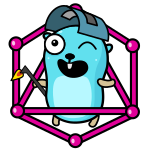

# GOPHER

> Advanced Golang Framework

## Bases:
* [Docker](https://www.docker.com)
* [Microservices](https://microservices.io)
* [Mono Repository](https://en.wikipedia.org/wiki/Monorepo)
* [Standard Project Layout](https://github.com/golang-standards/project-layout)

## Pre requirement
**macOS:**
```sh
brew install go
echo 'export GOPATH="$HOME/go"' >> ~/.zshrc
echo 'export PATH="$PATH:$(go env GOPATH)/bin"' >> ~/.zshrc
go install golang.org/x/tools/go/analysis/passes/shadow/cmd/shadow@latest

brew install protobuf
go install google.golang.org/protobuf/cmd/protoc-gen-go@latest
go install google.golang.org/grpc/cmd/protoc-gen-go-grpc@latest
go install github.com/favadi/protoc-go-inject-tag@latest

brew install --cask docker
```

**Linux using apt:**
```sh
wget "https://dl.google.com/go/$(curl -Ls https://go.dev/VERSION\?m\=text | head -n 1).linux-amd64.tar.gz"
tar -C /usr/local -xzf $(curl -Ls https://go.dev/VERSION\?m\=text | head -n 1).linux-amd64.tar.gz
echo 'export GOPATH="$HOME/go"' >> ~/.bashrc
echo 'export PATH=$PATH:$(go env GOPATH)/bin:/usr/local/go/bin"' >> ~/.bashrc
echo 'export PATH=$PATH:~/go/bin' >> ~/.bashrc
go install golang.org/x/tools/go/analysis/passes/shadow/cmd/shadow@latest

apt install -y protobuf-compiler
apt install -y build-essential
go install google.golang.org/protobuf/cmd/protoc-gen-go@latest
go install google.golang.org/grpc/cmd/protoc-gen-go-grpc@latest
go install github.com/favadi/protoc-go-inject-tag@latest
```

## Installation
```shell
go install github.com/mohsensamiei/gopher/v2/cmd/gopher@latest
```

## How to use
* Creating project codebase: `gopher init -rep [REPOSITORY URL] -reg [REGISTERY URL]`
* Creating a new service: `gopher srv -n [SERVICE NAME]`
* Creating a new command: `gopher cmd -s [SERVICE NAME] -n [COMMAND NAME]`
* Creating a new application: `gopher app -c [COMMAND NAME] -n [APPLICATION NAME]`
* Creating a new migration: `gopher migrate -c [COMMAND NAME] -n [MIGRATION NAME]`
* Creating a new language: `gopher lang -n [LANGUAGE ABBR]`
* Downloading project dependencies: `gopher dep`
* Generating the project protobuf codes: `gopher proto`
* Formatting the project codes: `gopher fmt`
* Testing the project: `gopher test`
* Building the project: `gopher build`
* Build and running the project: `gopher run`
* Running the project: `gopher up`